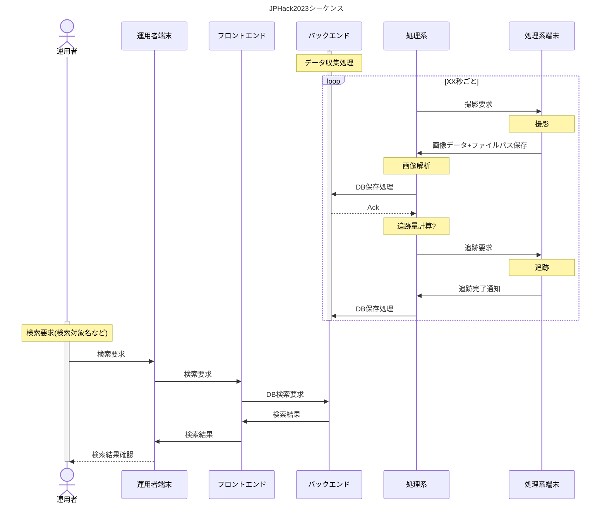

# サンプル（プロダクト名）

## 製品概要
### 背景(製品開発のきっかけ、課題等）
### 製品説明（具体的な製品の説明）

### 特長
#### 1. 特長1
#### 2. 特長2
#### 3. 特長3

### 解決出来ること
### 今後の展望
### 注力したこと（こだわり等）
* 
* 

## 開発技術
### 活用した技術
#### API・データ
* 
* 

#### フレームワーク・ライブラリ・モジュール
* 
* 

#### デバイス
* 
* 

### 独自技術
#### ハッカソンで開発した独自機能・技術
* 独自で開発したものの内容をこちらに記載してください
* 特に力を入れた部分をファイルリンク、またはcommit_idを記載してください。

#### 製品に取り入れた研究内容（データ・ソフトウェアなど）（※アカデミック部門の場合のみ提出必須）
* 
* 
